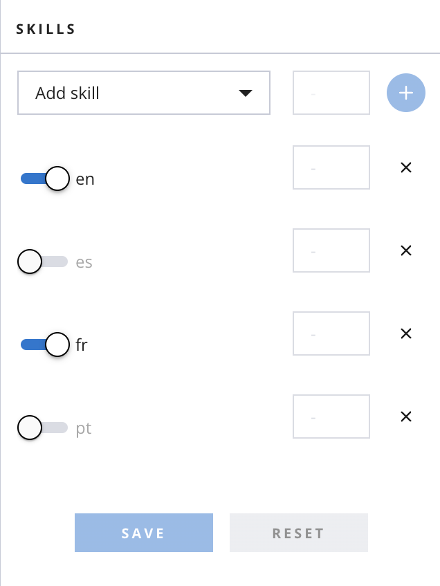

## Twilio Flex Translated Webchat
This plugin translates webchats between English and several other languages, allowing agents who only speak English to assist customers who do not speak English. It is one of two front-end code bases -- used collaboratively with a multi-language and translation-enhanced flex-webchat. It also requires a backend "translate" API. [More Info Here](https://blogs.perficient.com/2022/06/14/building-the-tower-of-babel-in-twilio-flex/) The two supplementary code bases can be found at the links below:

## This plugin can only be consumed with flex-webchat-ui-translation and the translate API:
You can fork the required supplementary repositories at the following links:
https://github.com/scriptkd/flex-webchat-ui-translation
https://github.com/scriptkd/translate

Before running this plugin, 
1. Set up your [translator API](https://github.com/scriptkd/translate) and assign its URL to the URL const in src/TranslateChatPlugin.js
2. Clone the [Translation Webchat UI](https://github.com/scriptkd/flex-webchat-ui-translation) and follow its README instructions to run it locally
3. Set up your Twilio Console to allow for conditional translation (more below)

## Setting up your Twilio Console

Your Flex project should come with a studio flow called Webchat Flow. You can find it in your Twilio console in Studio/Flows/Webchat Flow or Flex/Manage/Messaging/Webchat Flow. Add the following value to the Attributes object in the SendToFlex widget in Webchat Flow:
"language":"{{trigger.message.ChannelAttributes.pre_engagement_data.language}}"

In your Twilio console, find TaskRouter/Workspaces/Flex Task Assignment/Task Queues
Create a task queue for each language (English, Spanish, French, Portuguese)
Set the requirements for each queue to specify that routing.skills HAS its corresponding language code (en, es, fr, pt)

In your Twilio console, find TaskRouter/Workspaces/Flex Task Assignment/Workflows. Select the WebChatRouter Workflow
Update the WebChatRouter Workflow with four language filters, routing each filter to the corresponding webchat language queue, with WebChatEnglish as the default queue

Set up each non-English filter with two steps: first, look for agents skilled for the corresponding language queue. Then, send the task to the English queue if no agents are found. This will allow a translated chat experience ONLY when agents not skilled for that particular language are available.

Skill your agent for the languages that you do not want translated. This can be done from the Teams view within your Flex console. In the below image, the agent can receive French webchats untranslated, but will receive Spanish and Portuguese webchats translated to English.

## Running the plugin

` npm install `
` twilio flex:plugins:start ` 

## Deploying the plugin

Increase the version number by 1 in package.json
Run these two commands:
`twilio flex:plugins:build`
`twilio flex:plugins:deploy --major --changelog "your changelog here" --description "your description here" `
Release the plugin from within your Flex console (Admin/Manage Plugins)
Refresh the page to activate the update

## Development

Run `twilio flex:plugins --help` to see all the commands we currently support. For further details on Flex Plugins refer to our documentation on the [Twilio Docs](https://www.twilio.com/docs/flex/developer/plugins/cli) page.

# Twilio Flex Plugins

Twilio Flex Plugins allow you to customize the appearance and behavior of [Twilio Flex](https://www.twilio.com/flex). If you want to learn more about the capabilities and how to use the API, check out our [Flex documentation](https://www.twilio.com/docs/flex).